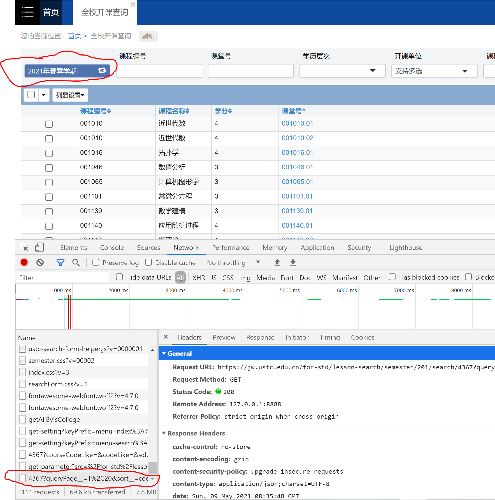
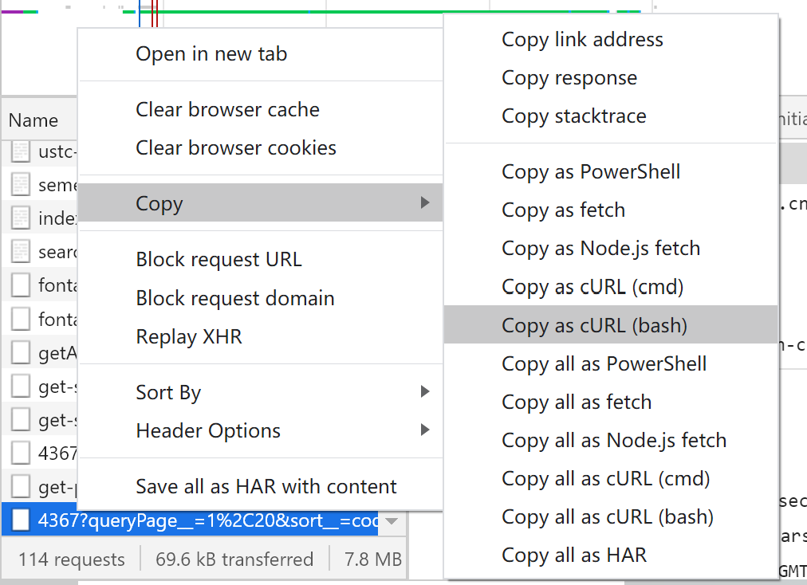
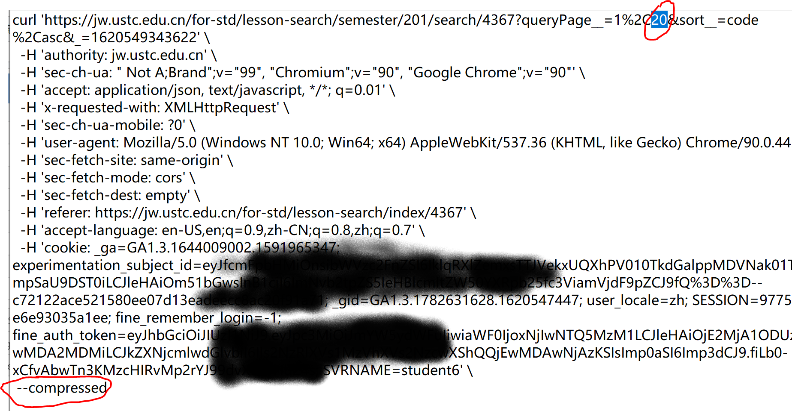

# How to import courses

## 从教务系统导入所有课程（推荐）

1. 用统一身份认证账号密码（本科学号/密码）登录综合教务系统 `https://jw.ustc.edu.cn/`
2. 打开浏览器 Developer Tools（Chrome 是 F12）中的 Network 选项卡
3. 点击一个请求，找到 Headers 里面的 cookie，把 cookie 复制下来
4. 在评课社区服务器上运行导入课程的脚本： `./tests/import_course_all_semesters.py <cookie>`，脚本会从最近的一个学期开始，从后往前导入各个学期的课程。因为一年之前的课程大多数情况下不会变化了，导入最近的两三个学期之后，可以 Ctrl+C 关掉（可能需要 Ctrl+C 多次才能停下来）。

输出类似是这样：
```
$ ./tests/import_course_all_semesters.py 'sduuid=xxxx; _ga=xxxx; SESSION=xxxxx; user_locale=zh; fine_remember_login=-1; fine_auth_token=xxx'
Found 67 semesters
Downloading semester 2022年秋季学期 (ID=281)
Download complete, importing semester 2022年秋季学期 (ID=281)
127 existing departments loaded
4262 existing teachers loaded
14269 existing courses loaded
60562 existing course classes loaded
45602 existing course terms loaded
...
New course 新闻、传媒翻译(邢鸿飞)
New course term 新闻、传媒翻译(邢鸿飞)@20221
New course class TINT6403P01@20221
load complete, committing changes to database
87 new teachers loaded
223 new courses loaded
841 new terms loaded
996 new classes loaded
52 new departments loaded
Import semester 2022年秋季学期 (ID=281) complete
Downloading semester 2022年夏季学期 (ID=261)
Download complete, importing semester 2022年夏季学期 (ID=261)
```

## 从教务系统导入某一个学期的课程

1. 使用Chrome浏览器
2. 用统一身份认证账号密码（本科学号/密码）登录综合教务系统 https://jw.ustc.edu.cn/
3. 打开浏览器Developer Tools（F12）中的Network选项卡
4. 点击综合教务系统网页中的“全校开课查询”，如图所示


5. 在左上角点击想要的学期，例如“2021年春季学期”（如果一开始就是想要的学期，那么先点一个别的学期，再点想要的这个学期），然后从Developer Tools中找到最后一个发出的HTTP请求。



6. 右键点击这个HTTP请求，Copy as curl (bash)。



7. Ctrl+V 粘贴到一个文本文件中，然后把curl命令第一行中的“20”改成“100000”（每次请求显示课程的条数，100000就是显示全部了）；把最后一行中的 "--compressed" 去掉（这样教务系统返回的就不是压缩后的数据，不然还要解压）。



8. 将修改后的文本文件内容（curl命令）粘贴到服务器的Linux终端上，命令结果输出到一个 json 文件：```curl ... >courses-20202.json```

```
$ curl 'https://jw.ustc.edu.cn/for-std/...
>   -H 'authority: jw.ustc.edu.cn' \
>   -H 'sec-ch-ua: " Not A;Brand";v="99", "Chromium";v="90", "Google Chrome";v="90"' \
......
>   -H 'cookie: ......
> > courses-20202.json
  % Total    % Received % Xferd  Average Speed   Time    Time     Time  Current
                                 Dload  Upload   Total   Spent    Left  Speed
100 14.1M    0 14.1M    0     0   487k      0 --:--:--  0:00:29 --:--:-- 3950k
```

9. 运行导入课程的脚本，参数是刚才curl下载下来的 JSON 文件。

```
$ ./import_courses_new.py ../data/courses-20202.json
110 existing departments loaded
3537 existing teachers loaded
12392 existing courses loaded
50458 existing course classes loaded
39286 existing course terms loaded
Data loaded with 2042 courses
Existing course 近世代数(欧阳毅)
Existing course term 近世代数(欧阳毅)@20202
Existing course class 00101001@20202
......
load complete, committing changes to database
15 new teachers loaded
95 new courses loaded
128 new terms loaded
65 new classes loaded
```

脚本运行完成后，课程导入过程就结束了。


## 从公共查询导入（不能解决老师重名的问题，不推荐）

网址：<https://catalog.ustc.edu.cn/query/lesson>。

1. 打开开发者工具，在 Network 中筛选 XHR 请求；
2. 刷新页面，选择需要导入的学期；
3. 此时应当能够从 Network 中看到两个 JSON 文件的请求，复制 URL 可以直接下载。
  - 第一个是学期（semester）列表信息（`semester/list`）；
  - 第二个是该学期的所有课程信息（`lesson/list-for-teach/<id>`），请记住下载时 URL 中的 id 的值。
4. 运行导入脚本：

```
$ python ./import_courses_catalog.py --id=241 --semester=path/to/semester.json --lesson=path/to/lesson.json
```

请将 `id` 设置为 URL 中显示的值。


